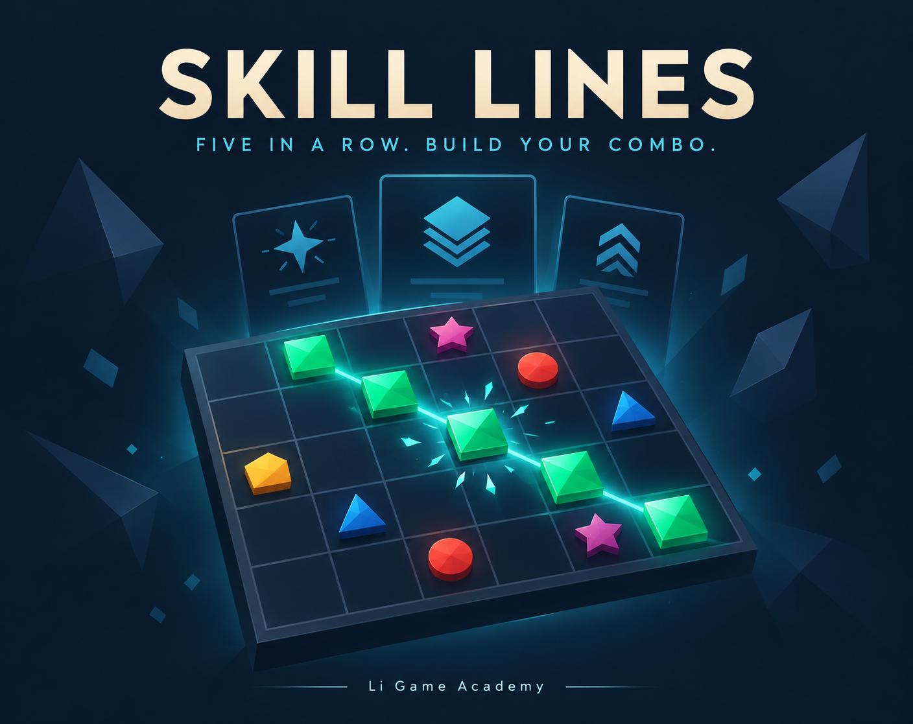
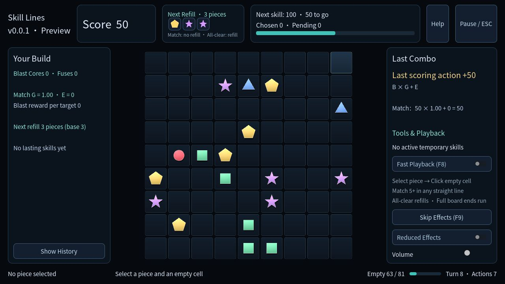
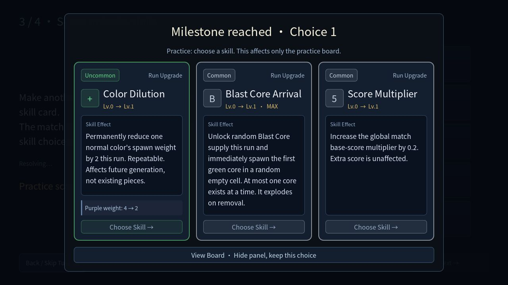
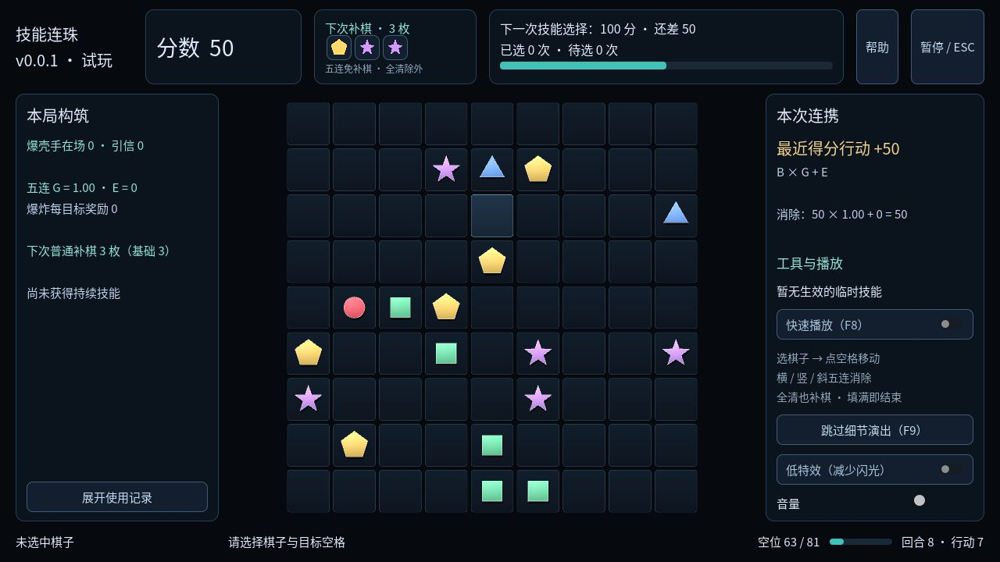

# 技能连珠 · Skill Lines

[浏览器试玩](https://godot-li.itch.io/roguematcher) · [English](README.md) · [0.0.1 预览版本](https://github.com/LiGameAcademy/GodotRogueMatcher/releases/tag/0.0.1)



**五子连珠 + 肉鸽技能构筑。** 在 9×9 棋盘上移动几何棋子，组成同色五连获得分数，在技能三选一中逐步形成自己的爆破构筑，尽量维持棋盘空间。

这是老李游戏学院的 **AI 辅助 Vibe Coding 开源教程项目**。玩法设计由人主导，开发过程中使用 Cursor 与 OpenAI Codex / ChatGPT 完成实现、审查、测试和迭代。我们会把这种协作方式本身作为教程的一部分。

## 0.0.1 已实现

- 32 项技能、白绿蓝紫橙五档稀有度、加权技能池与爆破手前置升级链。
- 永久升级、持续回合效果、颜色权重调整及颜色／行列清理。
- 颜色清理须主动选色确认；技能面板可临时收起查看棋盘。
- 特殊棋子说明、真实补棋预览、分数漂字、音效与低特效选项。
- 四步独立新手练习、帮助、暂停与本局结算。
- 英文／简体中文／跟随系统切换，入口位于开始或暂停菜单，设置保存在本机。






## 玩法与操作

点击棋子，再点击可到达的空格；路径只能穿过空格。横、竖或斜向同色五连及以上即可消除。没有直接形成五连时通常补 3 枚；全清后也会补棋。棋盘填满，本局结束。

得分达到门槛后选择技能；获取「主动爆破」升级后可以双击爆破棋子，占用一次行动。悬停特殊棋子查看效果。Esc 暂停／继续，F1 帮助菜单，F8 快速播放，F9 跳过允许略过的演出。

## 本地运行与验证

使用 **Godot 4.7.2**，克隆时包含子模块：

```sh
git clone --recurse-submodules https://github.com/LiGameAcademy/GodotRogueMatcher.git
```

导入 `project.godot`，运行主场景即可。`godot_core_system` 提供本地化、设置、触发器等通用能力，核心规则与表现分别维护。

```sh
godot --headless --path . -s addons/gut/gut_cmdln.gd -gdir=res://tests -ginclude_subdirs -gexit
```

Web 导出参见 [English README](README.md#run-the-source)，目录参见 [DIRECTORY.md](DIRECTORY.md)。

## 预览版边界

面向桌面浏览器、鼠标与键盘，建议不小于 1280×720。手机触控和跨刷新续局尚未实现。数值仍在调整，任务系统与新的主动救场棋子属于后续计划。

设置、练习完成标记和局内记录仅保存在本地浏览器，没有上传端点。清空网站存储会移除这些数据。

## 课程与支持

- [知识星球 · 老李游戏学院](https://wx.zsxq.com/group/28885154818841)
- [Patreon · Godot 教程与独立游戏开发](https://www.patreon.com/cw/LiGameAcademy)
- [哔哩哔哩](https://space.bilibili.com/8618918) · [YouTube](https://www.youtube.com/channel/UChFeMZTeF1HZbqVh_1HtN_w)
- [GitHub 问题反馈](https://github.com/LiGameAcademy/GodotRogueMatcher/issues) · [itch.io 评论区](https://godot-li.itch.io/roguematcher)

代码、文案和宣传封面使用了 AI 辅助；截图来自实际游戏。人工审查与可运行验证是交付流程的一部分，我们不回避这个项目的 Vibe Coding 属性。

项目采用 [GPL-3.0](LICENSE)，依赖保留各自许可。[Noto Sans SC 字体](assets/fonts/README.md)采用 SIL Open Font License；Godot 引擎采用 MIT 许可。
